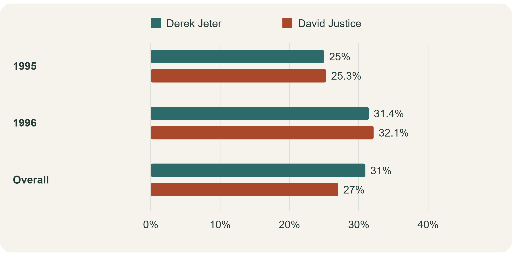

{width="500px"}

This is my first blog post. Example $\LaTeX$ equation: $\frac{1}{2}\sum_{i=1}^nx_i$

Have you ever watched The Simpsons? One of the most famous cartoon in U.S. I love the ironic plots and lovely characters in it. However,here is another Simpson worth meeting: Simpson's paradox. The shared name makes a fun introduction, but this statistical idea has nothing to do with Springfield. It describes a surprising reversal: a pattern appears in every subgroup, may be opposite with the conclusion that came up with all the groups combined. How can both stories be true?

---
subtitle: "1. Two hitters, one surprising scoreboard"
---
Consider the baseball example: Derek Jeter and David Justice in 1995 and 1996. A batting average is hits divided by at-bats, the batting opportunities counted in this statistic. Justice leads in both seasons: 25.3% versus 25.0%, then 32.1% versus 31.4%. Who would you expect to lead across both years?

```{r}
#| echo: false

baseball <- data.frame(
  Period = c("1995", "1996", "Combined"),
  `Derek Jeter` = c(
    "12/48 (25.0%)",
    "183/582 (31.4%)",
    "195/630 (31.0%)"
  ),
  `David Justice` = c(
    "104/411 (25.3%)",
    "45/140 (32.1%)",
    "149/551 (27.0%)"
  ),
  check.names = FALSE
)

knitr::kable(
  baseball,
  caption = "Hits / at-bats and batting percentages",
  align = c("l", "c", "c")
)
```
Jeter wins the combined comparison: 195 hits from 630 at-bats, or 31.0%, against Justice's 149 from 551, or 27.0%. About 92% of Jeter's opportunities came in 1996, when both players had higher averages. Only about 25% of Justice's came that year. Their combined averages therefore give very different importance to each season.


{width="500px"}
---
subtitle: "2. When the patient mix changes the winner"
---
The same reversal appears in published research. A 1986 study by Charig and colleagues compared kidney-stone treatments. Here we focus on open surgery (A) and percutaneous nephrolithotomy (B), which removes stones through a small opening. Success meant eliminating stones or reducing them below two millimetres after three months.

```{r}
#| echo: false
#| results: asis

cat(
  '<p style="font-size: 0.9em; color: #666;">
  Successes / patients and success rates.
  Small stones: under 2 cm; large: 2 cm or more.
  A = open surgery; B = percutaneous nephrolithotomy.
  </p>'
)

stones <- data.frame(
  `Stone size` = c("Small stones", "Large stones", "Overall"),
  `Treatment B` = c(
    "234/270 (86.7%)",
    "55/80 (68.8%)",
    "289/350 (82.6%)"
  ),
  `Treatment A` = c(
    "81/87 (93.1%)",
    "192/263 (73.0%)",
    "273/350 (78.0%)"
  ),
  check.names = FALSE
)

knitr::kable(
  stones,
  format = "html",
  align = c("l", "c", "c")
)
```
Overall, B succeeded in 82.6% of cases, compared with 78.0% for A. Yet A had higher success rates within both stone-size groups: 93.1% versus 86.7% for small stones, and 73.0% versus 68.8% for large stones. The winner changes when we combine the groups, just as it did with the baseball players.

Why? Large stones accounted for 263 of A's 350 cases, but only 80 of B's 350. Success was less common for large stones under either treatment. A therefore faced a much heavier concentration of difficult cases. The overall comparison mixes treatment outcomes with differences in the patients being treated.

subtitile: "The hidden ingredient: weights"
Both reversals come from weighted averages. In the formula, g labels a subgroup, r is its success rate, and w is its share of the relevant total. The weights add to one. Each player or treatment has its own weights, reflecting its particular mix of opportunities or cases. An overall result answers what happened in the observed mix; a standardized comparison asks what the rates would look like with the same mix. Both need a clearly stated purpose.

$$
\text{Overall rate}
= \sum_{g=1}^{G} w_g r_g,
\qquad
\sum_{g=1}^{G} w_g = 1
$$

---
