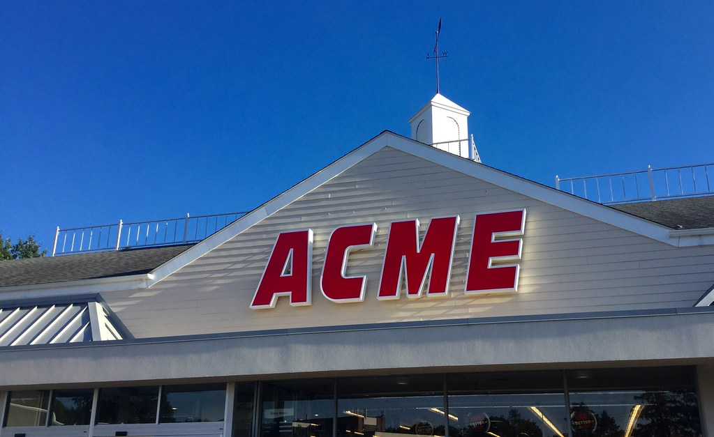
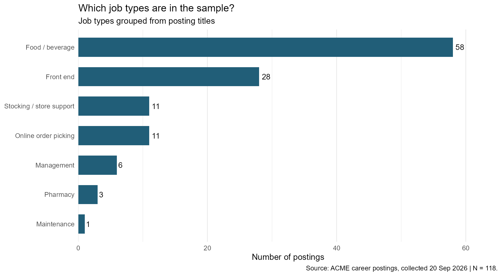
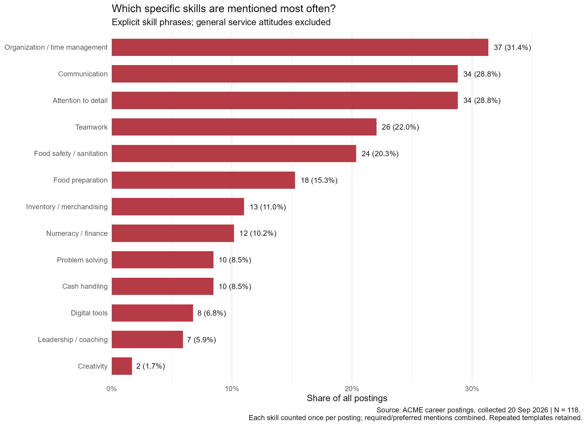
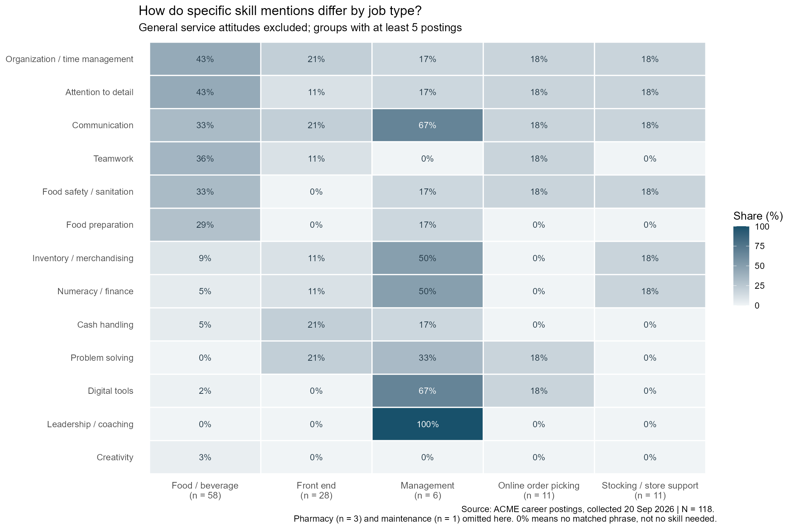

{width="500px"}

## Motivation and Research Question
ACME is one of the biggest retail supermarkets in Philadelphia; one of its stores is located just beside the University of Pennsylvania. I became curious about what kind of job positions the Philadelphia ACME store offered and what skills they would like to see in applicants. This blog aims to conduct research that focuses on which specific skills are mentioned most frequently in ACME’s Philadelphia-area job postings, and how these mentions differ across job types. I believe that after reading this article, you will be clear about what skills you should write on your resume or mention during an interview, rather than just saying you have good customer service. 

## Data acquisition
All the data comes from Albertsons Companies' official hiring website, filtered for the ACME brand only. The search condition is set to the area that is 25 kilometers around Philadelphia City. The search date is September 20th, 2026, with 118 results in total. Information like job title, job info, and job requirements is scraped by R rvest. Since the page loads dynamically, read_html_live() is used to scroll and load the list. Only public pages are accessed, and request intervals are set.

{width="500px"}

As the figure above, we can notice that almost half of the job positions are in the food/beverage area. One third of the positions are front-end jobs. Others are store support, online order picking, management, and a small amount in pharmacy and Maintenance. Jobs in food/beverage are mostly Deli Clerk, fresh-cut produce clerk, and so on.

## Methodology
To analyze the skills of these 118 job positions, we need to convert job requirements, which are in the form of long text, into keywords that can be used in skills frequency calculation. There were descriptions like “Helping customers and fellow associates gives your energy.”, which are attitudes that cannot be considered skills. “Ability to communicate effectively…” can be seen as communication skills. “Must be 18 years of age or older” is an age requirement that also needed to be ignored for skill calculation. The method I used to deal with this issue is to build a clear list of skill phrases to identify 13 specific skill categories. Each skill is counted at most once per job position.

For frequency calculation:
$$\text{Overall proportion}
= \frac{\text{number of positions mentioning the skill}}{118}
$$

$$\text{Group proportion}
= \frac{\text{Number of positions mentioning the skill within a category}}{
\text{Total number of positions in that category}}$$

What's more, this analysis measures the frequency with which specific skills are mentioned in job requirements, rather than the extent to which those skills are actually required for the role. Job Postings may omit skills that are implicitly expected or use phrasing not captured by keyword-based rules. Therefore, the absence of one specific skill in the data does not mean this role does not require it. For instance, the finding that "28.8% of job postings mention communication skills" is not equivalent to "only 28.8% of positions require communication skills." These results reflect requirements explicitly stated in the job postings and should not be interpreted directly as a ranking of skill importance.

## Findings
First, let’s look at skill frequency in a general way. In the diagram below, we can find that the top three high-frequency skills are organization/time management, communication, and attention to detail. 31.4% of jobs consider organization a requirement. While 28.8% of job positions seek applicants who are good at communication. 28.8% of job postings want applicants to focus on details in work.

{width="500px"}

Now, let's focus on the skill requirement differences by job category. Below is a matrix that shows how specific skill mentions differ by job type. For roles in food and beverage, which are mostly deli clerk or other counter clerk roles, organization, attention to detail, communication, teamwork, food safety, and food preparation skills are frequently mentioned in job requirements. However, for the manager role, skills concentrate on leadership, digital tools, communication, merchandising, and finance, which are very different from clerk jobs. For front-end, online order picking, and stocking jobs, things get different too. Front-end jobs have a relatively higher frequency on problem solving, cash handling. Stocking/store support has a focus on inventory and numeracy. Skill requirements do differ across different types of jobs.

{width="500px"}

## Key Takeaways
With those findings, applicants can prepare their resume and interview more strategically. Here are the three main findings and corresponding advice. 

1. Organization, communication, and attention to detail are the top three frequently mentioned skills.
   Applicants can prepare a real-life experience example about how they deal with multiple tasks at the same time. Or an example about how they focus on details so fewer mistakes are made. And how they communicate with others in an effective way.

2. For food/beverage category jobs, skills in food preparation and food safety are mentioned.
   For applicants who are interested in food/beverage type of job, highlight existing experience in food handling, cooking tool usage, or hygiene practices.

3. Management jobs consider leadership, coaching, communication, and problem-solving as important skills.
   Applicants seeking a manager role can prepare examples of how they train employees, assign tasks, and solve team issues.

## Limitation and Conclusion
The research had some limitations. Firstly, the data only contain one search of 118 results of job hiring information of ACME in the Philadelphia area. It cannot represent other retail companies' location hiring needs. Some job positions have exactly the same job requirements because they are similar job positions but in different stores. This may result in overcounting of some skills, that affect the skill frequency ranking. Also, my method to identify keywords may miss alternative expressions of the same skill. And the skill classification involves some of my judgment. The frequencies therefore reflect skills explicitly mentioned in job postings, rather than their importance or their effect on the likelihood of being hired.

In conclusion, organization and time management, attention to detail, and communication are the highest frequency skills in the samples. Different job categories have distinct skill requirements. For the job seeker, those findings can help them to identify the key skills that companies need for this position. They can prioritize skills related to real-life experience for resume and job interview preparation. Rather than simply listing keywords, clearly explaining how you applied these abilities to complete tasks ensures your application materials align more effectively with the job requirements.