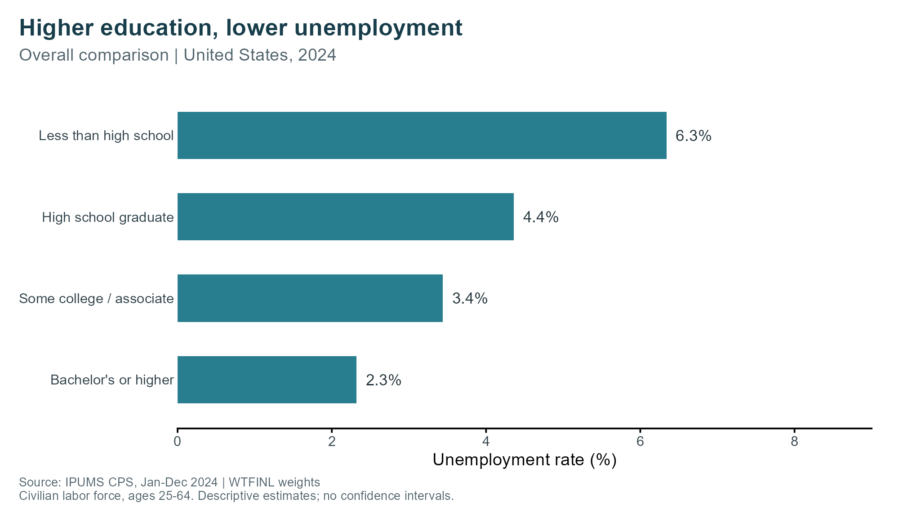
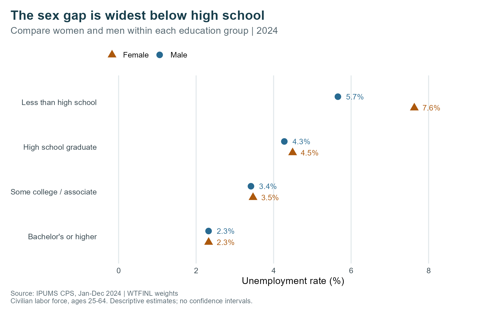
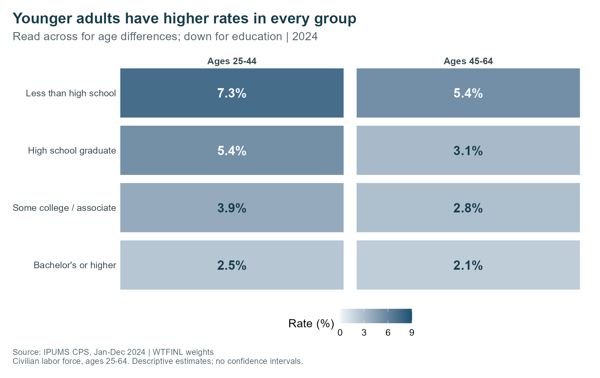

{width="100%"}

## Motivation and Research Question

[Code, data, and reproduction instructions](https://github.com/annzhao-77/BLOG3)

Education is often considered a way to improve job opportunities. As a graduate student, I am curious about whether we can use data to test the theory that people with different levels of education experience different unemployment rates. This blog uses U.S. Current Population Survey data from 2024 to analyze how unemployment varies by educational attainment among adults aged 25–64. And does this pattern differ by sex and age?

## Data and Methodology

The data are downloaded from the IPUMS CPS official website. The CPS is a monthly U.S. household survey conducted jointly by the U.S. Census Bureau and the Bureau of Labor Statistics. The survey was designed to measure unemployment. The research samples are selected from 12 basic monthly data in 2024. The target is the civilian labor force, aged 25 to 64. With the specific age group of 25-64, we can eliminate the effect caused by retirees and students who haven’t graduated. In the sample, there are four education groups in total: less than high school, high school graduate, some college, bachelor’s and above. 

I use the CPS person-level sampling weight, WTFINL, to calculate unemployment rates.(U) denotes unemployed person-month records and (L) denotes all person-month records in the civilian labor force within each group.
$$
\text{Unemployment rate}
=
\frac{\sum_{i \in U} \text{WTFINL}_i}
{\sum_{i \in L} \text{WTFINL}_i}
\times 100
$$
The labor force includes both employed and unemployed people. It excludes people outside the labor force, such as retirees and those who are not actively seeking work. I combine all 12 months of 2024, so the resulting rate is the ratio of the annual-average unemployed population to the annual-average labor force. Because the same person may be surveyed in multiple months, the observations represent person-month records.

## Findings

### Unemployment by Education

{width="800px"}
Firstly, let’s look at the pattern revealed in our sample data. In the sample,  as education level increased, the unemployment rate decreased. The people with an education group that is less than high school have an unemployment rate of 6.3%, while people who have an education level of bachelor’s or higher only have an unemployment rate of 2.3%. The data reflect that there is a valid relation between education level and unemployment. Are there any differences among sex groups or other traits? Let’s dive deeper into the data. 

### Comparing Men and Women

{width="100%"}

This diagram illustrates the differences between sex groups. For labor force who have educational level that is less than high school, there is a large gap between men and women. Women have an unemployment rate of 7.6%, while men only have an unemployment rate of 5.7%. As the educational level keeps increasing, the unemployment gap between women and men becomes smaller and reaches an equal level in the bachelor’s or higher education group. For the reason behind this pattern, I believe it may be related to job types that vary among different education group. People in the less-than-high-school education group may be more likely to participate in physically intensive job positions, where men will have a natural advantage over women.

### Comparing Age Groups

{width="100%"}
Lastly, I compared how results differ among age groups. Younger adults have higher unemployment rates in every education group. For adults in the less than high school education group, people in ages 26-44 have an unemployment rate of 7.3%, which is higher than people in ages 45-66. This pattern is consistent across every education group.

## Key Takeaways

Through these three diagrams, we can draw the conclusion that higher educational attainment is associated with lower unemployment among U.S. adults in the civilian labor force. In 2024, the weighted unemployment rate was approximately 6.3% for those without a high school diploma, compared with 2.3% for those with a bachelor’s degree or higher. However, differences remain within education groups. The female–male gap is largest among those without a high school diploma, while adults aged 25–44 have higher unemployment rates than those aged 45–64 in every education group. It suggests that education is an important part of the comparison, but it does not fully describe differences in unemployment.

## Limitations and Conclusion

As a research limitation, this analysis is descriptive and does not establish that additional education causes lower unemployment. Differences in occupation, industry, location, and family circumstances may also contribute to the observed patterns. Therefore, these figures do not capture gender differences in labor-force participation or establish why people are outside the labor force. Also, the analysis covers only 2024 and relies on survey estimates. 

In conclusion, higher education is associated with lower unemployment, although the size of the differences varies by sex and age. In this case, education provides a useful starting point for understanding unemployment patterns, but it is not a complete explanation.

## Data Source
This analysis uses the January–December 2024 Basic Monthly samples from [IPUMS CPS](https://cps.ipums.org/cps/). The underlying CPS data are provided by the U.S. Census Bureau and the Bureau of Labor Statistics.

Sarah Flood, Miriam King, Renae Rodgers, Steven Ruggles, J. Robert Warren, Daniel Backman, Etienne Breton, Grace Cooper, Julia A. Rivera Drew, Stephanie Richards, David Van Riper. *Integrated Public Use Microdata Series, Current Population Survey: Version 13.0* [dataset]. Minneapolis, MN: IPUMS, 2025. [https://doi.org/10.18128/D030.V13.0](https://doi.org/10.18128/D030.V13.0)MN: IPUMS, 2025. https://doi.org/10.18128/D030.V13.0
