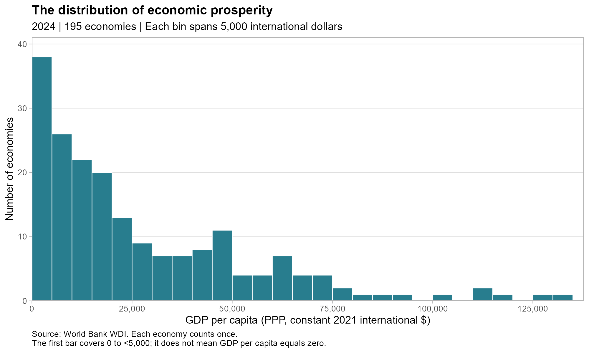
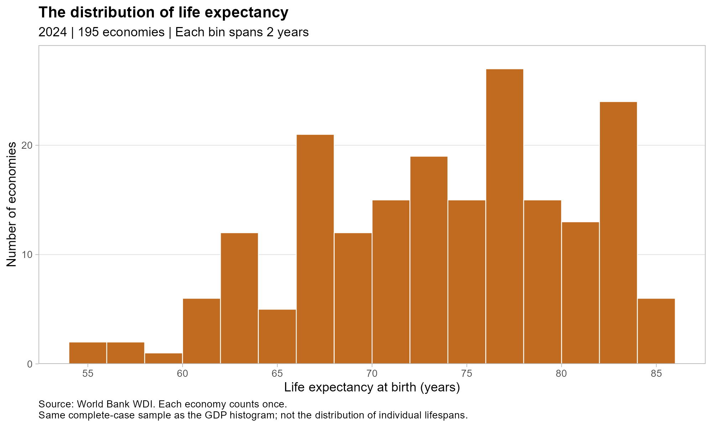
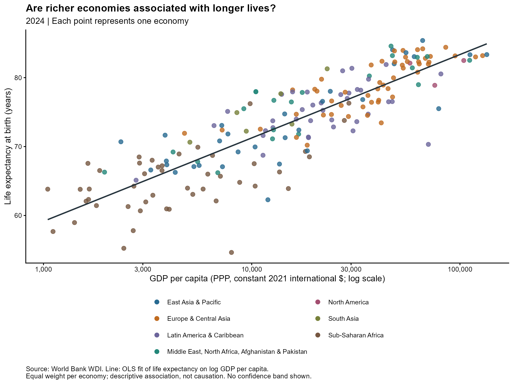
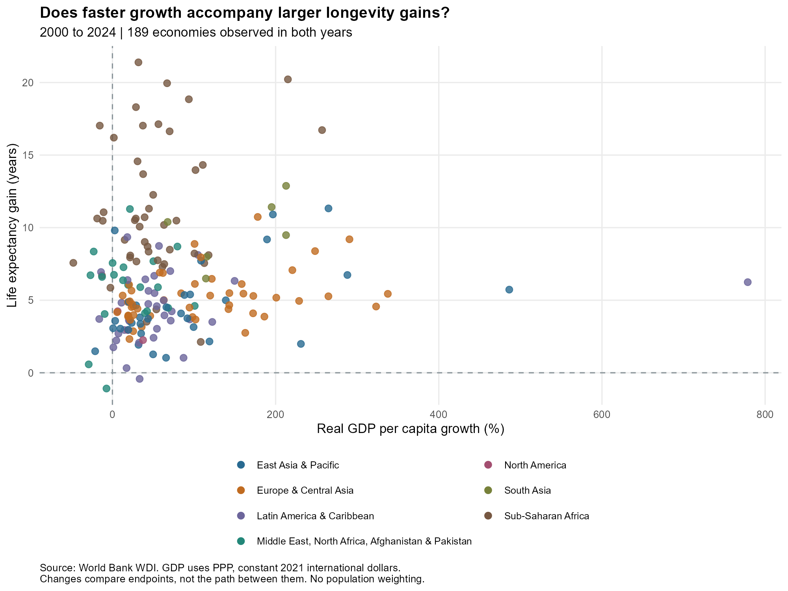

## Motivation and Research Question

Economic prosperity is often associated with better living conditions, but does it also go together with longer lives? This blog uses World Bank data to examine how GDP per capita relates to life expectancy across countries. It also asks whether faster economic growth between 2000 and 2024 accompanies larger improvements in life expectancy. These comparisons describe associations rather than causal relationship.

## Data and Methodology

The data come from World Bank: World Development Indicators. Using the WDI package in R, I downloaded two indicators: GDP per capita, PPP(constant 2021 international dollars), and life expectancy at birth, total(years). The dataset includes data from 2000 to 2024. Excluded aggregate entries, like world totals, regions, and income groups. The 2024 data includes 195 economies. For the comparison between 2000 and 2024, it includes 189 economies. Missing values are not replaced with zeros. Each economy have the same weight. 

GDP per capita refers to measure of economic prosperity in the following analysis. The per capita can used in comparison for differences in population size. Also purchasing power parity(PPP) adjusts for price level differences across economies, and the constant 2021 prices account for inflation when comparing values over time. However, this measure method represents average economic output rather than personal income. Life expectancy at birth measures how long a newborn would be expected to live if prevailing age-specific mortality rates remained unchanged. And for analysis, I use a logarithmic GDP axis to make differences across the economies easier to see. The fitted line that shows the association between life expectancy and the natural logarithm of GDP per capita, but not causal relation. For comparison of growth, I calculate cumulative GDP per capita growth as percentage and life expectancy gains in years.
$$
\text{GDP per capita growth (\%)}
=
\left(
\frac{\text{GDP per capita}_{2024}}
{\text{GDP per capita}_{2000}}
-1
\right)\times 100
$$

$$
\text{Life expectancy gain (years)}
=
LE_{2024}-LE_{2000}
$$

## Findings

### How Are Prosperity and Life Expectancy Distributed?

{width="100%"}

{width="100%"}
In the first diagram, we can see the distribution of 2024 GDP per capita right skewed obviously. Most economies are concentrated in relatively low GDP per capita range. Small amount of economies have extreme high value on GDP per capita. This concludes the economic prosperity in our sample data have large differences. Therefore, I used logarithmic axis in following scatterplot, so the differences between different countries can be observed easily.
In the second graph, it shows the life expectancy of most economies is between 65 to 85 years. But some economies have relatively lower life expectancy that form the tail on the left. These two distributions show variation in both economic prosperity and longevity. We will examine the relation between GDP per capita and life expectancy later in the following graph.

### Do Richer Economies Have Longer Lives?

{width="100%"}
The scatterplot above reflects a clear positive association between GDP per capita and life expectancy in 2024. Countries with higher GDP per capita usually have longer life expectancy. The fitted line summarizes the pattern with a linear regression of life expectancy on the natural logarithm of GDP per capita. However, the points are not all close to the line. Economies with similar GDP per capita can have distinct life expectancies. The economic prosperity does not fully justify the differences in longevity. Some other factors, like a country health care level, living habits may have influence on a country's life expectancy too.

### Does Economic Growth Accompany Longevity Gains?

{width="100%"}

This diagram compare 2000-2024 GDP per capita cumulative growth with increase of life expectancy. Most countries are in first quadrant of the graph, which indicates the economy growth and increase of life expectancy happened together. But compare to the clear positive relation show in the graph before, the dots in this diagram are more spread out. Two economies with similar economic growth, the improve of longevity may vary a lot. The economy with the largest growth may not have the largest increase of life expectancy. For example, China had a cumulative growth of GDP per capita of 486%, but only had increase in life expectancy of 5.7 year. Therefore, Wealthier economies usually have longer lifespans doesn't mean that the faster the growth, the more lifespan improves. This result suggests that to understand improvements in lifespan, we also need to consider initial life expectancy and other social and health factors. 

## Key Takeaways
There is a clear positive relation between economic prosperity and life expectancy. But economic growth doesn't show the clear relation to improvements in lifespan. Higher economy levels might come along with long term investments in healthcare, education, and public health, but economic growth doesn't directly turn into equal gains in life expectancy. Also, the initial life expectancy in different countreis may affect how much room there is for improvement. 

## Limitations and Conclusion
The analysis have some limitations. Firstly, all the diagram only show the association but not causal relation between economic prosperity and life expectancy. Factors like medical services, education, public health can influence lifespan. We didn't control these factors in this research. Secondly, GDP measure the aggregate output of an economy. it does not reflect personal income, and does not show whether the economic resource had transfer to health service that people can gain. Also, missing value made some economies be excluded from the comparsion. And the growth analysis compares only 2000 and 2024, it does not capture changes between these years. 
In conclusion, richer economies usually have longer life expectancies, but faster-growing economies don’t always see larger increase in lifespan. To understand improvement of lifespan, you need to consider both the level of economic development and other social and health conditions.

## Data Sources

World Bank. *World Development Indicators*. Indicators:

- [GDP per capita, PPP (constant 2021 international $)](https://data.worldbank.org/indicator/NY.GDP.PCAP.PP.KD), `NY.GDP.PCAP.PP.KD`.
- [Life expectancy at birth, total (years)](https://data.worldbank.org/indicator/SP.DYN.LE00.IN), `SP.DYN.LE00.IN`.

Data are downloaded programmatically using the World Bank API through the R package `WDI`. The retrieval date is recorded in the saved CSV. See [README](README.md) for replication instructions.
